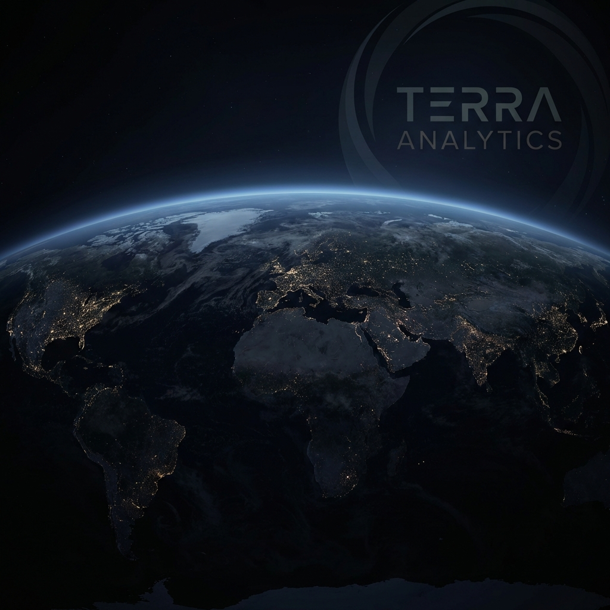

# GeoCore | Neural Terrain Engine 🌍🛰️

GeoCore is an advanced geospatial intelligence system designed for **Institutional Grade Land Cover Classification**. It leverages **GoogLeNet** (Inception v1) architecture to provide planetary-scale terrain analysis with high precision.

 *(Note: Add a real screenshot if available)*

## 🚀 Features

- **Neural Classification**: High-accuracy land cover recognition using Transfer Learning on the EuroSAT dataset.
- **Real-Time Inference**: Upload any satellite image (JPG, PNG, TIFF) and get instant predictions.
- **Dual-Mode UI**: Sleek, high-performance interface with support for **Dark Mode** and **Light Mode**.
- **Visual Signal Processing**: Interactive "Scanning" animations and confidence metrics for institutional-grade feedback.
- **Full Model Lifecycle**: Includes scripts for both automated training and deployment.

## 🛠️ Tech Stack

- **Deep Learning**: PyTorch, Torchvision (GoogLeNet)
- **Web Backend**: Flask (Python)
- **Frontend Architecture**: 
  - Tailwind CSS (Utility-first styling)
  - Lucide Icons (Visual semantics)
  - Google Fonts (Outfit)
- **Data Engineering**: EuroSAT Dataset (Sentinel-2 satellite imagery)

## 📊 Classification Categories

The engine is trained to recognize 10 distinct land cover types:
1.  **Annual Crop**
2.  **Forest**
3.  **Herbaceous Vegetation**
4.  **Highway**
5.  **Industrial**
6.  **Pasture**
7.  **Permanent Crop**
8.  **Residential**
9.  **River**
10. **Sea & Lake**

## 📥 Installation & Setup

### 1. Clone the Repository
```bash
git clone https://github.com/your-repo/geocore.git
cd geocore
```

### 2. Install Dependencies
```bash
pip install -r requirements.txt
```
*(Note: Ensure you have `torch`, `torchvision`, `flask`, `scikit-learn`, `matplotlib`, `seaborn`, and `pillow` installed.)*

### 3. Training the Model (Optional)
If you want to retrain the model or visualize performance metrics:
```bash
python train.py
```
This will:
- Auto-download the EuroSAT dataset.
- Train the GoogLeNet model.
- Generate Accuracy/Loss curves and a Confusion Matrix.
- Save the weight file as `googlenet_cloud_model.pth`.

### 4. Running the Web Application
```bash
python app.py
```
Visit `http://127.0.0.1:5000` in your browser to access the Neural Terrain Engine.

## 📈 Performance

The model uses a pre-trained **GoogLeNet** backbone, fine-tuned on the EuroSAT dataset. 
- **Image Resolution**: 224x224 (Standard ImageNet resolution).
- **Normalization**: Standard ImageNet mean/std.
- **Optimizer**: Adam with a learning rate of 1e-4.

## 📁 Project Structure

```text
├── app.py                # Flask Web Server
├── train.py              # Model Training & Evaluation Logic
├── googlenet_cloud_model.pth # Trained Model Weights
├── data/                 # Dataset Storage (Auto-generated)
├── static/               # Assets (Images, Uploads)
│   ├── bg_satellite.png  # UI Background
│   └── uploads/          # User-uploaded images
└── templates/
    └── index.html        # Main Neural Engine UI
```

---

**Institutional Grade Geospatial Intelligence.**
*Harnessing planetary-scale data for precise ecological and urban monitoring.*
